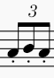

# BitSonata — Musical Programming Language Reference

**BitSonata** is a programming language where code is expressed as music. Programs are compositions built from melody, rhythm, harmony, and phrasing. The language syntax leverages musical theory concepts to encode variables, control flow, and operations.

---

## Table of Contents

- [Introduction](#introduction)
- [Language Concepts](#language-concepts)
- [Syntax Reference](#syntax-reference)
    - [Notes and Durations](#notes-and-durations)
    - [Variable Declaration](#variable-declaration)
    - [Variable Assignment](#variable-assignment)
    - [Arithmetic Operations](#arithmetic-operations)
    - [Control Flow](#control-flow)
- [File Format and Extensions](#file-format-and-extensions)
- [Sample Program](#sample-program)
- [Usage](#usage)
- [Future Work](#future-work)
- [License](#license)

---

## Introduction

BitSonata turns programming into musical composition. Each program begins with a **key signature** defined by the first chord, establishing tonal context. Variables are declared using specific rhythmic motifs followed by chord progressions as identifiers. Assignments and operations are expressed through melodic contours and rhythmic patterns.

The language is interpreted, designed to be readable both as code and as sheet music, enabling you to **hear your program** as a melody.

---

## Language Concepts

- **Variables:** Named as chord progressions (e.g., `Cmaj-Dmaj-Gmaj`). The progression can use any rhythm, but must not contain silences in the middle. The rhythm can change throughout the song.
- **Variable declaration:** Designated with a rhythmic motif.
- **Variable string assignment:** Uses a rhythmic motif and an ASCII parser.
- **Variable numeric assignment:** Uses a melodic line where note durations represent values.
- **Conditionals:** (Only `if` conditionals for now) Designated with Half Cadences (I–V), historically used to represent moments of doubt in music.
- **While loops:** Designated with Plagal Cadences (V–IV), referencing musical repetition.
- **Comparison:** Designated with different note intervals.
- **Basic arithmetic:** Represented with different melodic patterns.

---

## Syntax Reference

### Variable Declaration

- **Rhythmic motif:** `dotted eighth`, `16th`, and `quarter`. Notes can be any pitch, giving musical freedom.
    
    

- **Variable name:** Chord progression, any length or rhythm. This progression is the variable name throughout the code.
    
    

- **Optional silence:** Add a silence (any duration) at the end if the next instruction starts with a chord.

---

### Variable Numeric Assignment

- **Rhythmic motif:** *Three staccato triplets* (any melody within this rhythm).
    
    

- **Variable name:** Follows the motif, any rhythm.
- **Numeric value:** Encoded as a melodic pattern:
    - Ascending melody: **add** note durations.
    - Descending melody: **subtract** note durations.

#### Duration Map

| Name      | Notation    | Value |
|-----------|-------------|-------|
| Sixteenth | `sixteenth` | 0.25  |
| Eighth    | `eighth`    | 0.5   |
| Quarter   | `quarter`   | 1.0   |
| Half      | `half`      | 2.0   |
| Whole     | `whole`     | 4.0   |

> **Note:** The parser currently only supports melodies within the same octave. When the melody returns to the tonic, its value is subtracted and the summing process restarts.

---

#### Examples

**Assigning 9.5 to a variable**


*In F major:*

```
F (1) + G (1) + A (1) + Bb (1) + C (1) + D (1) + E (1) - F (1) + G (1) + A (1) + Bb (1) + C (0.5) = 9.5
```

---

**Assigning 3.75 to a variable**


*In F major:*

```
F (1) + G (1) + A (1) - G (0.5) - F (0.25) + F (1) + G (0.25) + G (0.25) + A (0.25) - G (0.25) = 3.75
```

---

**Assigning 9.25 to a variable**


*In F major:*

```
F (0.25) + F (1) + G (1) - F (1) + F (0.5) + G (0.5) + A (0.5) + Bb (0.5) + C (0.5) + D (0.5) + E (0.5) - F (1) + F (1) + G (0.5) + A (1) + Bb (1) + C (1) + D (1) = 9.25
```

---

#### Degree Table (F Major)

| Note | Degree |
|------|--------|
| F    | 1      |
| G    | 2      |
| A    | 3      |
| Bb   | 4      |
| C    | 5      |
| D    | 6      |
| E    | 7      |

- If the current note's degree is **higher** than the previous, add the note's duration value.
- If the degree is **lower**, subtract the duration value.

> The composer has musical freedom to create unique melodies.

---

### Variable String Assignment

- **Rhythmic motif:** *4 sixteenth notes* (any melody within this rhythm).
    
    

- **Variable name:** Follows the chord progression, any rhythm.
- **Followed by the tonic:** Must be followed by the tonic of the key.
- **String value:** Encoded as ASCII (explained below).

To encode 26 characters with only 7 scale notes, the duration adds "loops" around the scale (each loop adds 7 to the degree).

#### Loops Around the Scale Map

| Duration   | Loops Around |
|------------|--------------|
| Sixteenth  | 0            |
| Eighth     | 1            |
| Quarter    | 2            |
| Half       | 3            |
| Whole      | 4            |

---

#### Examples

**Assigning `HELLOWORLD` to a variable**


*In C major:*

| Note | Degree | Duration | Loops | Character |
|------|--------|----------|-------|-----------|
| C    | I      | eighth   | 1     | H         |
| G    | V      | 16th     | 0     | E         |
| G    | V      | eighth   | 1     | L         |
| G    | V      | eighth   | 1     | L         |
| C    | I      | quarter  | 2     | O         |
| D    | II     | half     | 3     | W         |
| C    | I      | quarter  | 2     | O         |
| F    | IV     | quarter  | 2     | R         |
| G    | V      | eighth   | 1     | L         |
| F    | IV     | 16th     | 0     | D         |

---

**Assigning `FIZZBUZZ` to a variable**


*In F major:*

| Note | Degree | Duration | Loops | Character |
|------|--------|----------|-------|-----------|
| D    | VI     | 16th     | 0     | F         |
| G    | II     | eighth   | 0     | I         |
| C    | V      | half     | 1     | Z         |
| C    | V      | half     | 1     | Z         |
| G    | II     | 16th     | 2     | B         |
| E    | VII    | quarter  | 3     | U         |
| C    | V      | half     | 2     | Z         |
| C    | V      | half     | 2     | Z         |

---

### Variable Update (Basic Arithmetic)

- **Rhythmic motif:** *2 sixteenth notes (staccato) and 1 eighth* (any melody within this rhythm).
    
    

- **Variable name:** Follows the chord progression, any rhythm.
- **Math expression:** Follows the motif.

#### Math Expressions

The same duration map applies:

| Name      | Notation    | Value |
|-----------|-------------|-------|
| Sixteenth | `sixteenth` | 0.25  |
| Eighth    | `eighth`    | 0.5   |
| Quarter   | `quarter`   | 1.0   |
| Half      | `half`      | 2.0   |
| Whole     | `whole`     | 4.0   |

- **Addition/Subtraction:**  
    The melody gives a value to add or subtract from the variable. Descending intervals yield negative values.

    **Examples:**

    - **Variable subtraction**
    
        
        - Rhythmic motif
        - Variable name (chord progression)
        - Descending interval: value is -1 (adds -1 to the variable)

    > Note: There is no direct way to assign 0. Assign a value (e.g., 2) and then subtract 2.

    - **Variable addition**
    
        
        - Rhythmic motif
        - Variable name (chord progression)
        - Ascending melody: adds 5

- **Multiplication:**  
    Repeat the same note; the sum of the durations multiplies the variable.

    **Example:**

    - **Variable multiplication**
    
        
        - Rhythmic motif
        - Variable name (chord progression)
        - Repeated note: sum durations (e.g., quarter + eighth = 1.5)

- **Division:**  
    - Rhythmic motif: *1 eighth, 2 sixteenth notes*
    - Value to divide by follows the rules of variable assignment.

    **Example:**

    - **Variable division**
    
        
        - Rhythmic motif
        - Variable name (chord progression)
        - Division motif (*1 eighth, 2 sixteenth*)
        - Melody gives value to divide by (e.g., quarter + quarter = 2)

---
